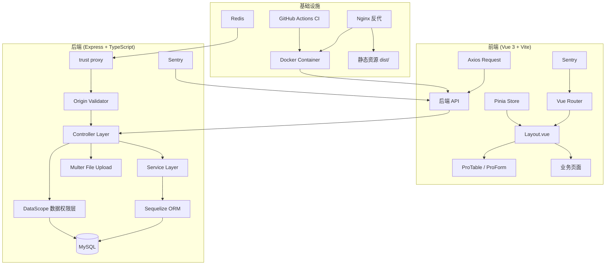

# Vue Admin

基于 **Vue 3 + Element Plus + Express + MySQL** 的全栈后台管理系统。

---

## 项目概述

Vue Admin 是一个功能完善的全栈后台管理系统，前端使用 Vue 3 + Vite + TypeScript，后端使用 Express + Sequelize ORM + TypeScript。系统开箱即用，自带用户认证（JWT 双 Token 机制 + HttpOnly Cookie）、动态菜单、RBAC 权限、行级数据权限（部门数据隔离）、文件管理、系统设置、字典管理、通知公告、消息推送（SSE 实时推送）、在线用户管理、定时任务调度、服务监控、全局搜索、暗黑模式、水印、密码找回、操作日志、Excel 导出、Swagger API 文档（Redoc）、多语言国际化、AI 代码生成助手（浮动聊天 + 代码预览 + 多提供商管理）、Web Vitals 性能监控等功能。

项目已实施多项安全加固与工程化优化：SQL 注入修复、SSE 一次性票据认证 + JWT-in-query 泄露修复、CSRF 纵深防御（Origin 校验 + SameSite=Strict）、Zod 共享 Schema 校验、Pinia 状态管理（9 个 Store）、轻量级 i18n 国际化、Composables 组合式函数（含 useSSE）、ProTable 组件拆分、BEM 命名规范、CSS 变量暗黑模式适配、响应式布局、XSS 防护（SVG 清洗）、数据库索引优化、生产环境错误信息脱敏（错误分级：409/400/500）、Helmet 安全头 + trust proxy、请求频率限制（滑动窗口 + Redis 多实例）、Sentry 错误监控 + Web Vitals RUM、Vitest 单元测试（35+ 前端文件 + 24 个后端文件）、E2E 测试（Playwright）、GitHub Actions CI/CD 流水线、Docker 多阶段构建、Kubernetes 部署清单 + 多副本一致性（Redis pub/sub 踢人）。

---

## 功能画廊

### 系统管理模块

| 页面 | 功能 |
|------|------|
| **仪表盘** | 数据统计卡片、快速入口、ECharts 图表可视化 |
| **用户管理** | 列表/搜索/新增/编辑/删除/批量删除/导入导出 |
| **角色管理** | 权限分配（树形）、数据权限、角色关联 |
| **菜单管理** | 树形展示、动态路由注册、图标选择 |
| **部门管理** | 树形管理、用户关联、父级选择 |
| **字典管理** | 多级字典、前端缓存、字典类型/数据分离 |
| **文件管理** | 上传/下载/删除/预览、按日期分目录 |
| **通知公告** | Markdown 富文本编辑、SSE 实时推送、已读标记 |

### 系统监控模块

| 页面 | 功能 |
|------|------|
| **在线用户** | 实时在线列表、强制下线 |
| **服务监控** | 服务器 CPU/内存/磁盘/网络 |
| **操作日志** | 用户操作审计、时间范围筛选、详情查看 |
| **定时任务** | CRON 调度、执行日志、手动触发 |

### 通用能力

- **全局搜索**：快捷键 ⌘K / Ctrl+K，按模块分组，键盘导航
- **标签页导航**：右键菜单（关闭/关闭其他/关闭左右/关闭全部），持久化到 localStorage
- **主题定制**：亮色/暗黑模式、8 种预设主色、自定义颜色、4 级字体
- **水印功能**：全局水印，防截图泄漏
- **多语言**：中英文切换，轻量级 i18n 方案，可扩展
- **列设置**：表格列显隐可配、排序状态持久化
- **SSE 实时推送**：一次性票据认证，安全可靠
- **导出进度条**：大数据量导出时实时显示进度
- **AI 代码生成助手**：浮动按钮 + 抽屉式对话界面，支持 Markdown/代码渲染、代码高亮、多提供商/模型切换、代码文件预览与一键应用（创建菜单/文件写入）、本地知识库 RAG 检索
- **Web Vitals 性能监控**：Core Web Vitals（CLS/FCP/LCP/TTFB/INP）实时采集并上报 Sentry，用于 RUM 真实用户监控
- **骨架屏加载**：页面和组件级别骨架屏（SkeletonLoader / PageSkeleton），提升加载感知体验
- **性能预算**：构建时校验 bundle 体积（JS/CSS 上限）、Lighthouse 评分（≥90），npm run analyze 可视化分析

---

## 系统架构



---

## 快速开发指南：30 分钟新增一个 CRUD 页面

以新增"文章管理"为例：

### 步骤 1：后端 Model + Controller + Route（约 10 分钟）

```typescript
// 1.1 新建 Model: server/models/Article.ts
import { Model, DataTypes } from 'sequelize'
import { sequelize } from '../config/database.js'

export class Article extends Model {
  declare id: number
  declare title: string
  declare content: string
  declare status: number
  declare createTime: Date
}

Article.init({
  id: { type: DataTypes.INTEGER, autoIncrement: true, primaryKey: true },
  title: { type: DataTypes.STRING(200), allowNull: false },
  content: { type: DataTypes.TEXT },
  status: { type: DataTypes.TINYINT, defaultValue: 1 },
  createTime: { type: DataTypes.DATE, defaultValue: DataTypes.NOW },
}, { sequelize, tableName: 'articles' })

// 1.2 新建 Controller: server/controllers/articleController.ts
import { Request, Response } from 'express'
import { Article } from '../models/Article.js'

export const articleController = {
  async list(req: Request, res: Response) {
    const { pageNum = 1, pageSize = 10 } = req.query
    const { rows, count } = await Article.findAndCountAll({
      offset: (Number(pageNum) - 1) * Number(pageSize),
      limit: Number(pageSize),
    })
    res.json({ code: 0, data: { rows, total: count } })
  },
  async create(req: Request, res: Response) {
    const article = await Article.create(req.body)
    res.json({ code: 0, data: article })
  },
  async update(req: Request, res: Response) {
    await Article.update(req.body, { where: { id: req.params.id } })
    res.json({ code: 0, data: null })
  },
  async delete(req: Request, res: Response) {
    await Article.destroy({ where: { id: req.params.id } })
    res.json({ code: 0, data: null })
  },
}

// 1.3 注册路由: server/routes/articleRoutes.ts
import { Router } from 'express'
import { articleController } from '../controllers/articleController.js'

const router = Router()
router.get('/articles', articleController.list)
router.post('/articles', articleController.create)
router.put('/articles/:id', articleController.update)
router.delete('/articles/:id', articleController.delete)
export default router

// 1.4 在 server/routes/index.ts 中注册
// import articleRoutes from './articleRoutes.js'
// router.use(articleRoutes)
```

### 步骤 2：前端页面（约 15 分钟）

```vue
<template>
  <CrudPage
    title="文章管理"
    :api="articleApi"
    :columns="columns"
    :search-fields="searchFields"
    :form-schema="formSchema"
    :default-form="{ title: '', status: 1 }"
  />
</template>

<script setup lang="ts">
import CrudPage from '@/components/CrudPage.vue'
import { request } from '@/utils/request'

interface Article {
  id: number
  title: string
  content: string
  status: number
}

const articleApi: CrudApi<Article> = {
  list: (params) => request.get('/api/articles', { params }),
  create: (data) => request.post('/api/articles', data),
  update: (id, data) => request.put(`/api/articles/${id}`, data),
  delete: (id) => request.delete(`/api/articles/${id}`),
}

const columns = [
  { prop: 'title', label: '标题', minWidth: 200 },
  { prop: 'content', label: '内容', minWidth: 300, showOverflowTooltip: true },
  { prop: 'status', label: '状态', width: 80, formatter: (row: any) => row.status === 1 ? '启用' : '禁用' },
]

const searchFields = [
  { prop: 'title', label: '标题', type: 'input' },
]

const formSchema = [
  { prop: 'title', label: '标题', type: 'input', required: true },
  { prop: 'content', label: '内容', type: 'textarea' },
  { prop: 'status', label: '状态', type: 'select', options: [{ label: '启用', value: 1 }, { label: '禁用', value: 0 }] },
]
</script>
```

### 步骤 3：配置菜单（约 2 分钟）

在 `server/bootstrap.ts` 或数据库 `menus` 表中新增菜单记录即可。

---

## 项目里程碑

| 版本 | 功能 |
|------|------|
| v1.0 | 基础 CRUD + 用户认证 + RBAC 权限 |
| v1.5 | ProTable/ProForm 组件化 + 动态菜单 + 多语言 |
| v2.0 | 暗黑模式 + 主题定制 + 标签页导航 + 全局搜索 |
| v2.5 | SSE 实时推送 + 文件管理 + Docker 部署 |
| v3.0 | ECharts 仪表盘 + 定时任务 + 服务监控 |
| v3.5 | Vitest 单元测试 + GitHub Actions CI + Sentry 错误监控 |
| v4.0 | Redis 多实例限流 + Umzug 数据库迁移 + Zod 共享 Schema + K8s 部署清单 |
| v4.1 | 行级数据权限 + CSRF 纵深防御 + 多副本踢下线 + 后端单元测试 + trust proxy |
| v4.2 | AI 代码生成助手（浮动聊天 + 代码预览 + 多提供商管理） + SSE Composable + Web Vitals |
| v4.3 | 骨架屏组件 + 性能预算 + Lighthouse CI + GitHub Actions Release + 前后端测试增强 |

---

## 技术栈

### 前端

| 技术 | 版本 | 用途 |
|------|------|------|
| [Vue 3](https://vuejs.org/) | ^3.4.0 | 前端 MVVM 框架（Composition API + `<script setup>`） |
| [TypeScript](https://www.typescriptlang.org/) | ^5.6.0 | 前端类型安全 |
| [Vue Router 4](https://router.vuejs.org/) | ^4.3.0 | 前端路由管理 |
| [Pinia](https://pinia.vuejs.org/) | ^3.0.4 | 状态管理（userStore / menuStore / notificationStore / settingStore / appStore） |
| [Element Plus](https://element-plus.org/) | ^2.7.0 | 桌面端 UI 组件库（unplugin 自动按需导入） |
| [Element Plus Icons Vue](https://element-plus.org/en-US/component/icon.html) | ^2.3.1 | 图标库 |
| [Axios](https://axios-http.com/) | ^1.7.0 | HTTP 请求库 |
| [Zod](https://zod.dev/) | ^3.25.76 | Schema 校验（前后端共享校验规则） |
| [ECharts](https://echarts.apache.org/) | ^6.1.0 | 图表可视化 |
| [md-editor-v3](https://imzbf.github.io/md-editor-v3/) | ^6.5.3 | Markdown 编辑器 |
| [highlight.js](https://highlightjs.org/) | ^11.11.1 | 代码语法高亮（AI 代码预览，懒加载） |
| [katex](https://katex.org/) | ^0.17.0 | LaTeX 数学公式渲染（Markdown 增强） |
| [marked](https://marked.js.org/) | ^12.0.0 | Markdown 解析器（AI 助手消息渲染） |
| [mermaid](https://mermaid.js.org/) | ^11.16.0 | 图表/流程图渲染（Markdown 增强） |
| [sortablejs](https://sortablejs.github.io/Sortable/) | ^1.15.7 | 列表拖拽排序 |
| [web-vitals](https://github.com/GoogleChrome/web-vitals) | ^5.3.0 | Core Web Vitals 性能指标采集 |
| [Vite](https://vitejs.dev/) | ^6.3.0 | 前端构建工具（开发服务器 + 打包） |
| [Vitest](https://vitest.dev/) | ^4.1.9 | 单元测试框架（覆盖率报告） |
| [@sentry/vue](https://docs.sentry.io/platforms/javascript/guides/vue/) | ^9.0.0 | 前端错误监控 |
| [pinia-plugin-persistedstate](https://prazdevs.github.io/pinia-plugin-persistedstate/) | ^4.7.1 | Pinia 状态持久化 |
| [@vitejs/plugin-vue](https://github.com/vitejs/vite-plugin-vue) | ^5.2.4 | Vite Vue 3 插件 |
| [Sass](https://sass-lang.com/) | ^1.101.0 | CSS 预处理器 |
| [NProgress](https://github.com/rstacruz/nprogress) | ^0.2.0 | 页面加载进度条（路由跳转 + API 请求） |
| [@types/nprogress](https://www.npmjs.com/package/@types/nprogress) | ^0.2.3 | NProgress TypeScript 类型声明 |
| [unplugin-auto-import](https://github.com/antfu/unplugin-auto-import) | ^21.0.0 | Vue、Pinia 自动导入 |
| [unplugin-vue-components](https://github.com/antfu/unplugin-vue-components) | ^32.1.0 | Element Plus 组件自动按需导入 |
| [unplugin-icons](https://github.com/antfu/unplugin-icons) | ^23.0.1 | 图标自动按需导入 |
| [vite-plugin-compression](https://github.com/anncwb/vite-plugin-compression) | ^0.5.1 | 构建时生成 Gzip 预压缩文件 |
| [vitest](https://vitest.dev/) | ^4.1.9 | 单元测试框架（覆盖率报告） |
| [vue-tsc](https://github.com/johnsoncodehk/volar/tree/master/packages/vue-tsc) | ^3.3.5 | TypeScript 类型检查 |

### 后端

| 技术 | 版本 | 用途 |
|------|------|------|
| [Express](https://expressjs.com/) | ^4.19.0 | Node.js Web 框架 |
| [TypeScript](https://www.typescriptlang.org/) | ^6.0.3 | 类型安全 |
| [Zod](https://zod.dev/) | ^3.25.76 | Schema 校验（与前端共享校验规则） |
| [Sequelize](https://sequelize.org/) | ^6.37.0 | ORM 数据库映射层 |
| [MySQL2](https://github.com/sidorares/node-mysql2) | ^3.9.0 | MySQL 数据库驱动 |
| [Multer](https://github.com/expressjs/multer) | ^2.2.0 | 文件上传中间件 |
| [jsonwebtoken](https://github.com/auth0/node-jsonwebtoken) | ^9.0.3 | JWT 用户认证（Access Token + Refresh Token） |
| [bcryptjs](https://github.com/dcodeIO/bcrypt.js) | ^3.0.3 | 密码加密哈希 |
| [Dotenv](https://github.com/motdotla/dotenv) | ^16.4.0 | 环境变量加载 |
| [svg-captcha](https://github.com/produck/svg-captcha) | ^1.4.0 | SVG 图形验证码 |
| [nodemailer](https://nodemailer.com/) | ^9.0.1 | 邮件发送（密码找回） |
| [node-cron](https://github.com/node-cron/node-cron) | ^4.5.0 | 定时任务调度 |
| [exceljs](https://github.com/exceljs/exceljs) | ^4.4.0 | Excel 导入导出 |
| [swagger-jsdoc](https://github.com/Surnet/swagger-jsdoc) | ^6.3.0 | OpenAPI 文档生成 |
| [swagger-ui-express](https://github.com/scottie1984/swagger-ui-express) | ^5.0.1 | Swagger UI 界面（已替换为 Redoc） |
| [cookie-parser](https://github.com/expressjs/cookie-parser) | ^1.4.7 | Cookie 解析 |
| [ioredis](https://github.com/redis/ioredis) | ^5.11.1 | Redis 客户端（多实例限流 / 缓存降级） |
| [Umzug](https://github.com/sequelize/umzug) | ^3.8.3 | 数据库迁移引擎（替代 sequelize.sync） |
| [selfsigned](https://github.com/jfromaniello/selfsigned) | ^5.5.0 | 自签名 HTTPS 证书生成 |
| [helmet](https://helmetjs.github.io/) | ^8.2.0 | 安全 HTTP 头（CSP / HSTS / XSS 防护） |
| [openai](https://github.com/openai/openai-node) | ^4.47.0 | OpenAI / 兼容 API 客户端（AI 助手后端） |

### 测试与工程化

| 技术 | 版本 | 用途 |
|------|------|------|
| [Vitest](https://vitest.dev/) | ^4.1.9 | 单元测试框架（前后端统一） |
| [@vue/test-utils](https://test-utils.vuejs.org/) | ^2.4.11 | Vue 组件测试工具 |
| [Playwright](https://playwright.dev/) | ^1.61.1 | E2E 浏览器自动化测试 |
| [ESLint 9](https://eslint.org/) | ^9.0.0 | 代码质量检查（Flat Config） |
| [Prettier](https://prettier.io/) | ^3.0.0 | 代码格式化 |
| [Husky](https://typicode.github.io/husky/) | ^9.0.0 | Git Hooks 管理 |
| [lint-staged](https://github.com/okonet/lint-staged) | ^15.0.0 | 暂存文件检查 |
| [Commitlint](https://commitlint.js.org/) | ^21.2.0 | 提交信息规范（Conventional Commits） |
| [conventional-changelog-cli](https://github.com/conventional-changelog/conventional-changelog) | ^5.0.0 | 自动生成 CHANGELOG |
| [jsdom](https://github.com/jsdom/jsdom) | ^29.1.1 | 测试环境 DOM 模拟 |
| [cross-env](https://github.com/kentcdodds/cross-env) | ^7.0.3 | 跨平台环境变量设置 |
| [concurrently](https://github.com/open-cli-tools/concurrently) | ^8.2.0 | 并行运行命令 |

---

## 环境要求

- **Node.js** >= 20.x（见 `.nvmrc`）
- **MySQL** >= 8.0
- **Redis** >= 7（可选，多实例限流）
- **npm** >= 9.x

---

## 快速安装

### 1. 克隆项目

```bash
git clone <仓库地址>
cd vue-admin
```

### 2. 配置环境变量

前端和根目录均需要环境变量配置：

**前端环境变量**（根目录）：
```bash
# 复制环境变量模板
cp .env.example .env.development
# 根据实际环境修改 .env.development 中的配置
```

**后端环境变量**（server/ 目录）：
编辑 `server/.env`，根据实际环境修改：

```ini
# 数据库配置
DB_HOST=127.0.0.1
DB_PORT=3306
DB_NAME=vue_admin       # 数据库名称，需提前创建
DB_USER=root
DB_PASSWORD=root

# 服务配置
SERVER_PORT=5173

# JWT 密钥（生产环境请修改为随机字符串）
JWT_SECRET=your_secret_key_here

# 邮件配置（密码找回功能，可选）
SMTP_HOST=smtp.example.com
SMTP_PORT=587
SMTP_SECURE=false
SMTP_USER=noreply@example.com
SMTP_PASS=your_smtp_password
```

### 3. 创建数据库

登录 MySQL 并创建数据库：

```sql
CREATE DATABASE IF NOT EXISTS vue_admin DEFAULT CHARSET utf8mb4 COLLATE utf8mb4_unicode_ci;
```

### 4. 一键安装所有依赖

```bash
npm run install:all
```

该命令会自动安装 **后端（server/）** 和 **前端（根目录）** 的所有依赖。

---

## 开发模式运行

```bash
npm run dev
```

- 前端由 Vite 开发服务器热更新
- 后端由 Express 直接运行
- 访问地址：https://localhost:5173（自签名证书，首次需在浏览器信任）

> 开发模式下，Vite 中间件内嵌在 Express 中，前端代码由 Vite 提供实时编译和 HMR（热模块替换）。

---

## 打包构建

```bash
npm run build
```

前端构建产物输出到根目录 `dist/`；后端 TypeScript 编译产物输出到 `server/dist/`。

打包后启动生产模式：

```bash
npm start
```

> 内部使用 `cross-env` 跨平台设置环境变量，Windows / Linux / macOS 均可正常运行。

> 生产模式下，Express 直接托管 `server/public/` 中的静态文件。

### 方案四：Kubernetes 容器编排部署（生产环境）

项目已提供完整的 K8s 部署清单（`k8s/` 目录），使用 Kustomize 统一管理。

```bash
# 1. 进入 k8s 目录
cd k8s

# 2. 修改 Secret（务必修改为强密码）
# 编辑 kustomization.yaml 中的 JWT_SECRET 和 DB_PASSWORD

# 3. 部署到集群
kubectl apply -k .

# 4. 查看部署状态
kubectl -n vue-admin get all

# 5. 查看 Ingress 地址
kubectl -n vue-admin get ingress
```

**K8s 资源清单**：

| 资源 | 类型 | 说明 |
|------|------|------|
| namespace.yaml | Namespace | 独立命名空间 `vue-admin` |
| configmap.yaml | ConfigMap | 应用非敏感配置（数据库名、日志级别等） |
| nginx-configmap.yaml | ConfigMap | Nginx 配置（Gzip、SSE、缓存策略） |
| mysql-statefulset.yaml | StatefulSet | MySQL 8.0 有状态集（持久卷、健康检查） |
| redis-deployment.yaml | Deployment | Redis 7 AOF 持久化 |
| server-deployment.yaml | Deployment | Node.js 后端服务 |
| frontend-deployment.yaml | Deployment | Nginx 托管前端静态资源 |
| ingress.yaml | Ingress | API 反向代理 + 前端路由 |
| kustomization.yaml | Kustomization | 资源编排 + Secret 生成 |

> 注意：K8s 部署需要集群中预先配置 Ingress Controller（如 nginx-ingress）。

---

本项目 **所有源文件必须使用 UTF-8 编码（无 BOM）** 保存。

| 文件类型 | 编码要求 |
|---------|---------|
| .vue / .ts / .js / .tsx / .jsx | UTF-8 |
| .json / .yml / .yaml | UTF-8 |
| .scss / .css / .less | UTF-8 |
| .md 文档 | UTF-8 |

项目根目录已配置 `.editorconfig` 文件（`charset = utf-8`），主流 IDE 会自动遵循此设置。

> ⚠️ **注意**：如果文件保存为非 UTF-8 编码，中文内容会显示为乱码（如 `汉字`、`ֵ` 等）。请在编辑器中确认文件编码设置为 UTF-8。

---

## API 文档

项目集成了 Swagger (OpenAPI 3.0) 文档，启动服务后访问：

```
http://localhost:3000/api/docs
```

使用 Redoc 渲染，界面美观清晰，支持在线调试。

---

## 部署

### 方案一：直接部署（推荐小项目）

执行以下命令（**Windows / Linux / macOS 通用**）：

```bash
# 1. 打包前端
npm run build

# 2. 将项目上传到服务器（忽略 node_modules 和 .env）

# 3. 安装依赖
npm run install:all

# 4. 配置环境变量（server/.env）

# 5. 启动服务
npm start
```

#### Windows 服务器 —— 使用 PM2 进程守护

```bash
# 安装 PM2
npm install -g pm2

# 启动服务
pm2 start server/dist/app.js --name vue-admin

# 设置开机自启
pm2 save
pm2 startup
```

> PM2 在 Windows 上会注册为系统服务，重启后自动恢复。

#### Windows 服务器 —— 使用 IIS 反向代理

如需通过 IIS 暴露 80 端口，安装 [iisnode](https://github.com/tjanczuk/iisnode) 模块后配置 `web.config`：

```xml
<configuration>
  <system.webServer>
    <handlers>
      <add name="iisnode" path="server/dist/app.js" verb="*" modules="iisnode" />
    </handlers>
    <rewrite>
      <rules>
        <rule name="API">
          <match url="api/*" />
          <action type="Rewrite" url="server/dist/app.js" />
        </rule>
      </rules>
    </rewrite>
  </system.webServer>
</configuration>
```

#### Linux 服务器 —— 使用 PM2 进程守护

```bash
npm install -g pm2
pm2 start server/dist/app.js --name vue-admin
pm2 save
pm2 startup   # 按提示执行设置开机自启命令
```

### 方案二：Nginx 反向代理（推荐 Linux 生产环境）

```nginx
# /etc/nginx/conf.d/vue-admin.conf
server {
    listen 80;
    server_name your-domain.com;

    location /api/ {
        proxy_pass http://127.0.0.1:3000;
        proxy_set_header Host $host;
        proxy_set_header X-Real-IP $remote_addr;
        proxy_set_header X-Forwarded-For $proxy_add_x_forwarded_for;
        proxy_set_header X-Forwarded-Proto $scheme;
    }

    location /uploads/ {
        proxy_pass http://127.0.0.1:3000;
    }

    location / {
        proxy_pass http://127.0.0.1:3000;
        proxy_set_header Host $host;
        proxy_set_header X-Real-IP $remote_addr;
    }
}
```

```bash
sudo nginx -t
sudo systemctl reload nginx
```

### 方案三：Docker 容器化部署（推荐）

项目已提供多阶段构建 Dockerfile 和 docker-compose.yml，一键启动 MySQL + Node 服务。

```bash
# 1. 复制环境变量模板
cp .env.example .env.production
# 编辑 .env.production，配置数据库密码等

# 2. 启动所有服务（MySQL + Node + Nginx）
docker-compose up -d

# 3. 查看服务状态
docker-compose ps

# 4. 查看日志
docker-compose logs -f server

# 5. 停止服务
docker-compose down
```

**docker-compose 服务说明**：

| 服务 | 端口 | 说明 |
|------|------|------|
| mysql | 3306 | MySQL 8.0 数据库（数据持久化到 `mysql_data` 卷） |
| server | 3000 | Node.js 后端（Express） |
| nginx | 80 | Nginx 反向代理（可选，前端静态资源 + API 代理） |

**Docker 特性**：
- 多阶段构建减小镜像体积
- 非 root 用户运行（appuser）
- 健康检查自动监控服务状态
- 数据卷持久化（MySQL 数据、上传文件、日志）
- 环境变量区分配置（development / staging / production）

---

## 项目结构

```
vue-admin/
├── server/                          # 后端（TypeScript）
│   ├── app.ts                       # 入口文件（中间件组装：Helmet、CORS、Sentry、Redoc、路由注册）
│   ├── bootstrap.ts                 # 启动逻辑（数据库自动创建、迁移、种子数据、前端托管）
│   ├── swagger.ts                   # OpenAPI / Swagger 文档配置（Redoc 渲染）
│   ├── .env                         # 环境变量配置
│   ├── package.json                 # 后端依赖
│   ├── tsconfig.json                # TypeScript 配置（ES2022 + nodenext）
│   ├── vitest.config.ts             # 后端 Vitest 测试配置
│   ├── config/                      # 配置模块
│   │   ├── index.ts                 # 配置读取（数据库 / JWT / Redis / 服务端口）
│   │   ├── database.ts              # Sequelize ORM 数据库连接（连接池 10 个）
│   │   └── redis.ts                 # Redis 连接管理（单例模式、自动降级）
│   ├── shared/                      # 前后端共享模块
│   │   └── schemas/                 # Zod Schema 校验规则（前后端共享）
│   │       ├── auth.ts              # 认证 Schema（login / passwordReset / changePassword）
│   │       ├── user.ts              # 用户管理 Schema（create / update / query）
│   │       ├── menu.ts              # 菜单管理 Schema
│   │       ├── dept.ts              # 部门管理 Schema
│   │       ├── dict.ts              # 字典管理 Schema
│   │       ├── notice.ts            # 通知管理 Schema
│   │       ├── role.ts              # 角色管理 Schema
│   │       ├── common.ts            # 通用 Schema（pagination / id / dateRange）
│   │       └── index.ts             # 统一导出
│   ├── models/                      # 数据模型（Sequelize ORM，16 个模型）
│   │   ├── User.ts                  # 用户模型（含 deptId 索引、status / username 复合索引）
│   │   ├── Role.ts                  # 角色模型（含 dataScope 数据权限范围字段）
│   │   ├── UserRole.ts              # 用户-角色关联
│   │   ├── Menu.ts                  # 菜单模型（含 parentId / status / hidden 索引）
│   │   ├── RoleMenu.ts              # 角色-菜单关联
│   │   ├── Department.ts            # 部门模型（树形结构，parentId 自关联）
│   │   ├── DictType.ts              # 字典类型
│   │   ├── DictData.ts              # 字典数据（含 dictType / sort 索引）
│   │   ├── Notice.ts                # 通知公告
│   │   ├── NoticeRead.ts            # 通知已读记录
│   │   ├── Message.ts               # 站内消息
│   │   ├── Setting.ts               # 系统设置（key-value 键值对）
│   │   ├── Task.ts                  # 定时任务
│   │   ├── Log.ts                   # 操作日志
│   │   ├── RefreshToken.ts          # Refresh Token 持久化（含 userId / purpose 联合索引）
│   │   └── AiProvider.ts            # AI 提供商配置（实验性模块使用）
│   ├── controllers/                 # 控制器层（19 个控制器）
│   │   ├── authController.ts        # 认证登录（SSE 票据签发、密码找回、Token 刷新）
│   │   ├── userController.ts        # 用户管理（Excel 导出、数据权限过滤）
│   │   ├── menuController.ts        # 菜单管理（树形 / 选项 / 后台列表）
│   │   ├── roleController.ts        # 角色管理（含 dataScope 数据权限配置）
│   │   ├── deptController.ts        # 部门管理
│   │   ├── aiController.ts          # AI 代码生成（聊天 / 文件应用）
│   │   ├── aiProviderController.ts  # AI 提供商管理（CRUD / 状态切换）
│   │   ├── settingController.ts     # 系统设置
│   │   ├── dictTypeController.ts    # 字典类型
│   │   ├── dictDataController.ts    # 字典数据
│   │   ├── noticeController.ts      # 通知公告（SSE 推送）
│   │   ├── messageController.ts     # 站内消息
│   │   ├── logController.ts         # 日志查询
│   │   ├── uploadController.ts      # 文件上传（按日期分目录）
│   │   ├── dashboardController.ts   # 仪表盘统计
│   │   ├── searchController.ts      # 全局搜索
│   │   ├── taskController.ts        # 定时任务管理
│   │   ├── onlineUserController.ts  # 在线用户管理（强制踢下线）
│   │   └── serverController.ts      # 服务监控（CPU / 内存 / 磁盘）
│   ├── services/                      # 服务层（业务逻辑，25+ 个文件）
│   │   ├── authService.ts           # 认证服务（登录、Token 刷新、SSE 票据、密码找回）
│   │   ├── userService.ts           # 用户服务（含数据权限 dataScope 解析）
│   │   ├── roleService.ts           # 角色服务
│   │   ├── AIAssistant.ts           # AI 代码生成服务（多提供商调用、RAG 知识库检索）
│   │   ├── AiProviderService.ts     # AI 提供商管理（CRUD、多实例）
│   │   ├── CodeInjector.ts          # AI 代码注入引擎（文件写入、菜单创建）
│   │   ├── LocalFileRAG.ts          # 本地文件 RAG 检索（知识库索引）
│   │   └── ...                        # menuService / dictService / noticeService / taskService 等
│   ├── routes/                      # 路由层（14 个路由文件）
│   │   ├── index.ts                 # 路由聚合入口（含 OpenAPI 注解 + Zod 校验中间件 + originValidator）
│   │   ├── authRoutes.ts            # 认证路由
│   │   ├── userRoutes.ts            # 用户管理路由
│   │   ├── menuRoutes.ts            # 菜单管理路由
│   │   ├── roleRoutes.ts            # 角色管理路由
│   │   ├── deptRoutes.ts            # 部门管理路由
│   │   ├── settingRoutes.ts         # 系统设置路由
│   │   ├── ai.routes.ts             # AI 代码生成路由
│   │   ├── dictTypeRoutes.ts        # 字典类型路由
│   │   ├── dictDataRoutes.ts        # 字典数据路由
│   │   ├── noticeRoutes.ts          # 通知公告路由
│   │   ├── logRoutes.ts             # 日志路由
│   │   ├── uploadRoutes.ts          # 文件上传路由
│   │   └── dashboardRoutes.ts       # 仪表盘路由
│   ├── middleware/                  # 中间件（7 个）
│   │   ├── auth.ts                  # JWT 认证中间件
│   │   ├── accessLog.ts             # HTTP 访问日志（包装 res.end）
│   │   ├── errorHandler.ts          # 全局错误处理（生产环境脱敏）
│   │   ├── rateLimiter.ts           # 登录频率限制（滑动窗口限流）
│   │   ├── rateLimitStore.ts        # 限流存储抽象层（Redis / 内存降级）
│   │   ├── originValidator.ts       # CSRF 防御（Origin/Referer 白名单校验）
│   │   ├── slowQueryLog.ts          # 慢查询日志（>1000ms 记录）
│   │   └── validate.ts              # Zod Schema 校验中间件
│   ├── validators/                  # 后端校验（4 个文件）
│   │   ├── auth.ts                  # 认证校验
│   │   ├── common.ts               # 通用校验
│   │   ├── dept.ts                  # 部门校验
│   │   └── index.ts                 # 统一导出
│   ├── utils/                       # 工具模块（15 个文件）
│   │   ├── fileLogger.ts            # 文件日志（按日期切割、30 天轮转、日志分级）
│   │   ├── logger.ts                # 数据库操作日志工具
│   │   ├── captcha.ts               # SVG 图形验证码生成
│   │   ├── mailer.ts                # 邮件发送（Nodemailer，支持 SMTP 配置）
│   │   ├── scheduler.ts             # 定时任务调度器（node-cron）
│   │   ├── sseManager.ts            # SSE 实时推送管理器（一次性票据认证）
│   │   ├── onlineUsers.ts           # 在线用户管理（含 Redis pub/sub 多副本踢下线）
│   │   ├── siteCache.ts             # 站点信息缓存 + HTML 动态注入
│   │   ├── migrator.ts              # Umzug 迁移引擎（迁移 + 种子数据）
│   │   ├── exportExcel.ts           # Excel 导出工具
│   │   ├── dictCache.ts             # 字典数据缓存
│   │   ├── dataScope.ts             # 数据权限工具（部门隔离 / dataScope 范围解析）
│   │   ├── diff.ts                  # 对象差异对比工具
│   │   ├── generateCert.ts          # HTTPS 自签名证书生成
│   │   └── helpers.ts               # 通用辅助函数
│   ├── migrations/                  # 数据库迁移（16 个，按时间戳排序）
│   │   ├── 20260707_000001_create-users.cjs
│   │   ├── 20260707_000002_create-roles.cjs
│   │   ├── ...                      # 覆盖所有数据表
│   │   ├── 20260707_000015_create-logs.cjs
│   │   └── 20260717_000001_legacy-compat.ts # 旧数据兼容迁移（dataScope 字段补全）
│   ├── seeders/                     # 种子数据（7 个）
│   │   ├── 20260707_000001_admin_user.cjs
│   │   ├── 20260707_000002_default_roles.cjs
│   │   ├── 20260707_000003_default_departments.cjs
│   │   ├── 20260707_000004_default_menus.cjs
│   │   ├── 20260707_000005_admin_role.cjs
│   │   ├── 20260707_000006_default_settings.cjs
│   │   └── 20260707_000007_default_tasks.cjs
│   ├── scripts/
│   │   └── migrate.ts               # 迁移 CLI 脚本（up / down / seed / reset / status）
│   ├── types/                       # 类型声明
│   │   ├── express.d.ts             # Express 类型扩展（req.user）
│   │   └── sequelize.d.ts           # Sequelize 类型扩展
│   ├── __tests__/                   # 后端单元测试（24 个测试文件）
│   │   ├── authMiddleware.test.ts
│   │   ├── authService.test.ts
│   │   ├── captcha.test.ts
│   │   ├── dataScope.test.ts        # 数据权限范围解析测试
│   │   ├── errorHandler.test.ts
│   │   ├── fileLogger.test.ts
│   │   ├── generateCert.test.ts
│   │   ├── helpers.test.ts
│   │   ├── logger.test.ts
│   │   ├── mailer.test.ts
│   │   ├── migrator.test.ts
│   │   ├── onlineUsers.test.ts
│   │   ├── rateLimiter.test.ts
│   │   ├── resetToken.test.ts
│   │   ├── scheduler.test.ts
│   │   ├── siteCache.test.ts
│   │   ├── slowQueryLog.test.ts
│   │   ├── sseManager.test.ts
│   │   ├── uploadValidator.test.ts
│   │   ├── userService.test.ts
│   │   ├── validate.test.ts
│   │   ├── accessLog.test.ts
│   │   ├── dictCache.test.ts
│   │   ├── diff.test.ts
│   │   └── exportExcel.test.ts
│   ├── dist/                        # 编译产物（tsc 输出）
│   ├── logs/                        # 日志文件（自动生成，按日期切割）
│   └── uploads/                     # 上传文件（自动生成，按日期分目录）
│
├── src/                             # 前端（Vue 3 + Vite + TypeScript）
│   ├── main.ts                      # Vue 入口（Pinia、v-permission 指令、Element Plus locale、Sentry）
│   ├── App.vue                      # 根组件（Session 恢复、站点信息注入、SSE 连接）
│   ├── router/                      # 路由管理
│   │   ├── index.ts                 # Vue Router 配置 + 路由守卫（登录态 + 强制改密）
│   │   ├── dynamicRoutes.ts         # 动态路由管理（根据后端菜单注册 / 恢复 / 清理）
│   │   ├── initSession.ts           # 会话初始化（页面刷新后恢复登录态 + 站点信息）
│   │   ├── keepAlive.ts             # 路由组件缓存管理（白名单动态配置）
│   │   └── preload.ts               # 路由预加载（兄弟路由）
│   ├── api/                         # API 请求封装（TypeScript，18 个 API 模块）
│   │   ├── index.ts                 # 统一导出
│   │   ├── auth.ts                  # 认证 API
│   │   ├── user.ts                  # 用户管理 API
│   │   ├── menu.ts                  # 菜单管理 API
│   │   ├── role.ts                  # 角色管理 API
│   │   ├── dept.ts                  # 部门管理 API
│   │   ├── dict.ts                  # 字典管理 API
│   │   ├── notice.ts                # 通知公告 API
│   │   ├── message.ts               # 站内消息 API
│   │   ├── setting.ts               # 系统设置 API
│   │   ├── log.ts                   # 日志 API
│   │   ├── upload.ts                # 文件上传 API
│   │   ├── dashboard.ts             # 仪表盘 API
│   │   ├── search.ts                # 全局搜索 API
│   │   ├── onlineUser.ts            # 在线用户 API
│   │   ├── task.ts                  # 定时任务 API
│   │   ├── server.ts                # 服务监控 API
│   │   └── ai.ts                    # AI 代码生成 API（聊天 / 文件应用 / 提供商管理）
│   ├── stores/                      # Pinia 状态管理（9 个 Store）
│   │   ├── index.ts                 # 统一导出
│   │   ├── pinia.ts                 # Pinia 实例
│   │   ├── userStore.ts             # 用户状态（登录态、Token、角色、权限）
│   │   ├── appStore.ts              # 应用状态（侧边栏、暗黑模式、主题、布局）
│   │   ├── menuStore.ts             # 菜单状态（动态路由、菜单树缓存）
│   │   ├── themeStore.ts            # 主题状态（主色、字号）
│   │   ├── layoutStore.ts           # 布局状态（多标签页、导航模式）
│   │   ├── localeStore.ts           # 语言状态（中英文切换）
│   │   ├── settingStore.ts          # 系统设置缓存
│   │   ├── siteStore.ts             # 站点信息
│   │   └── notificationStore.ts     # 通知状态（SSE 连接、未读数、票据认证）
│   ├── i18n/                        # 国际化（轻量级自定义方案）
│   │   ├── index.ts                 # i18n 核心（useI18n / t / setLocale）
│   │   ├── zh-CN.ts                 # 中文语言包
│   │   └── en-US.ts                 # 英文语言包
│   ├── composables/                 # 组合式函数（6 个）
│   │   ├── index.ts                 # 统一导出
│   │   ├── useCrud.ts               # CRUD 页面逻辑（列表 / 分页 / 搜索 / 增删改）
│   │   ├── useDialog.ts             # 弹窗逻辑复用
│   │   ├── useExport.ts             # 导出逻辑复用
│   │   ├── useExportProgress.ts     # 导出进度复用
│   │   ├── useRequestCache.ts       # 请求缓存复用
│   │   └── useSSE.ts                # SSE 连接管理（指数退避重连 / 心跳保活 / 自动 ticket）
│   ├── directives/                  # 自定义指令
│   │   └── permission.ts            # v-permission 按钮级权限指令
│   ├── utils/                       # 工具函数
│   │   ├── request.ts               # Axios 封装（拦截器、Token 刷新队列、缓存、NProgress）
│   │   ├── requestCache.ts          # 请求缓存（GET 结果缓存 + 非 GET 失效）
│   │   ├── response.ts              # 响应处理工具
│   │   ├── validators.ts            # 前端校验规则
│   │   ├── error.ts                 # 统一错误信息提取（getErrorMessage）
│   │   ├── errors.ts                # AppError 自定义错误类
│   │   ├── download.ts              # 通用文件下载（downloadBlob）
│   │   ├── sanitize.ts              # XSS 防护（sanitizeSvg 清洗脚本 / 事件）
│   │   ├── debounce.ts              # 防抖 / 节流工具函数
│   │   ├── dynamicIcons.ts          # 动态图标注册
│   │   ├── nprogress.ts             # NProgress 进度条配置
│   │   ├── mdEditorSetup.ts         # Markdown 编辑器增强配置（Mermaid / Katex 集成）
│   │   └── webVitals.ts             # Core Web Vitals 性能指标上报（CLS/FCP/LCP/TTFB/INP → Sentry）
│   ├── components/                  # 通用组件
│   │   ├── CrudPage.vue             # CRUD 页面模板（ProTable + FormDialog 组合）
│   │   ├── CrudTable.vue            # CRUD 表格模板
│   │   ├── FormDialog.vue           # 表单弹窗组件
│   │   ├── PageHeader.vue           # 页面标题组件
│   │   ├── SearchBar.vue            # 搜索栏组件
│   │   ├── TableCard.vue            # 表格卡片组件
│   │   ├── ErrorBoundary.vue        # 错误边界组件
│   │   ├── MenuIcon.vue             # 菜单图标组件（动态 SVG 渲染）
│   │   ├── Watermark.vue            # 全局水印组件（CSS 实现）
│   │   ├── VirtualTable.vue         # 虚拟滚动表格
│   │   ├── Permission.vue           # 权限控制组件（<Permission codes="['admin']">）
│   │   ├── EmptyState.vue           # 空状态组件（统一空数据展示）
│   │   ├── SkeletonLoader.vue       # 骨架屏加载组件（通用占位）
│   │   ├── PageSkeleton.vue         # 页面级骨架屏（Layout 骨架）
│   │   ├── AIAssistant/             # AI 代码生成助手（浮动按钮 + 抽屉对话 + 代码预览）
│   │   │   └── index.vue
│   │   ├── ProTable/                # 高级表格组件
│   │   │   ├── index.vue            # 主组件（搜索 + 表格 + 分页 + 列设置 + 导出）
│   │   │   ├── SearchForm.vue       # 搜索表单子组件（defineModel 双向绑定 + 防抖）
│   │   │   ├── TablePagination.vue  # 分页子组件
│   │   │   └── ColumnSettings.vue   # 列可见性设置（localStorage 持久化）
│   │   ├── ProForm/                 # 高级表单组件（Schema 驱动）
│   │   │   ├── index.vue
│   │   │   ├── ProformItem.vue
│   │   │   ├── ProFormInput.vue
│   │   │   └── ProFormMoney.vue
│   │   └── layout/                  # 布局组件
│   │       ├── LayoutHeader.vue     # 顶部栏（响应式、全局搜索、通知、用户菜单）
│   │       ├── LayoutSidebar.vue    # 侧边栏（动态菜单树、递归渲染）
│   │       ├── LayoutBreadcrumb.vue # 面包屑导航（i18n、多级路由 matched）
│   │       ├── NavTabs.vue          # 标签页导航（右键菜单、持久化）
│   │       ├── GlobalSearch.vue     # 全局搜索（⌘K / Ctrl+K，键盘导航）
│   │       ├── NotificationCenter.vue # 通知中心（SSE 票据认证、未读红点）
│   │       └── ThemeSettingsPanel.vue # 主题设置面板（暗黑模式、主色、字号、布局）
│   ├── views/                       # 页面组件（24 个页面）
│   │   ├── Layout.vue               # 主布局（响应式、标签页、骨架屏、水印、AI 助手悬浮按钮）
│   │   ├── Login.vue                # 登录页（验证码、记住我、响应式）
│   │   ├── LoginPage.vue            # 登录页配置页
│   │   ├── Register.vue             # 用户注册
│   │   ├── AiProviderManager.vue    # AI 提供商管理页
│   │   ├── Dashboard.vue            # 仪表盘（骨架屏、ECharts 图表）
│   │   ├── UserList.vue             # 用户管理（导入 / 导出）
│   │   │   └── user/
│   │   │       ├── UserFormDialog.vue   # 用户表单弹窗
│   │   │       └── UserImportDialog.vue # 用户导入弹窗
│   │   ├── Profile.vue              # 个人中心
│   │   ├── MenuList.vue             # 菜单管理（树形）
│   │   ├── RoleManager.vue          # 角色管理（权限树）
│   │   ├── DeptManager.vue          # 部门管理（树形）
│   │   ├── DictManager.vue          # 字典管理
│   │   ├── FileManager.vue          # 文件管理
│   │   ├── NoticeManager.vue        # 通知公告（Markdown 编辑器）
│   │   ├── MessageList.vue          # 站内消息
│   │   ├── Settings.vue             # 系统设置
│   │   ├── SystemLog.vue            # 操作日志
│   │   ├── OnlineUsers.vue          # 在线用户
│   │   ├── TaskManager.vue          # 定时任务
│   │   ├── ServerMonitor.vue        # 服务监控
│   │   ├── ForceChangePassword.vue  # 强制改密
│   │   ├── ResetPassword.vue        # 重置密码
│   │   ├── NotFound.vue             # 404
│   │   ├── Forbidden.vue            # 403
│   │   ├── RouteView.vue            # 路由占位组件
│   │   └── SubMenu.vue              # 子菜单递归组件
│   ├── assets/                      # 静态资源
│   │   └── theme.scss               # 全局主题样式（CSS 变量、BEM 命名、暗黑适配）
│   ├── types/                       # 前端类型声明
│   │   ├── api.d.ts                 # 前端 API 类型声明
│   │   ├── response.ts              # 响应类型（ApiResponse / PaginatedData）
│   │   └── table.ts                 # 表格相关类型（ColumnDef / CrudApi 等）
│   ├── __tests__/                   # 前端单元测试（Vitest，35+ 文件 300+ 用例）
│   │   ├── aiApi.test.ts            # AI API 测试
│   │   ├── api.test.ts              # API 模块测试
│   │   ├── appStore.test.ts         # 应用状态测试
│   │   ├── userStore.test.ts        # 用户认证状态测试
│   │   ├── menuStore.test.ts        # 菜单状态测试
│   │   ├── settingStore.test.ts     # 系统设置状态测试
│   │   ├── siteStore.test.ts        # 站点信息状态测试
│   │   ├── i18n.test.ts             # 国际化测试
│   │   ├── validators.test.ts       # 校验规则测试
│   │   ├── requestCache.test.ts     # 请求缓存测试
│   │   ├── request.test.ts          # 请求拦截器测试
│   │   ├── response.test.ts         # 响应工具函数测试
│   │   ├── error.test.ts            # 错误处理测试
│   │   ├── errors.test.ts           # AppError 错误类测试
│   │   ├── sanitize.test.ts         # XSS 清洗测试
│   │   ├── debounce.test.ts         # 防抖/节流测试
│   │   ├── permission.test.ts       # 权限指令测试
│   │   ├── useDialog.test.ts        # 弹窗逻辑测试
│   │   ├── useCrud.test.ts          # CRUD 逻辑测试
│   │   ├── useExport.test.ts        # 导出逻辑测试
│   │   ├── useExportProgress.test.ts # 导出进度测试
│   │   ├── useRequestCache.test.ts  # 请求缓存测试
│   │   ├── useSSE.test.ts           # SSE 连接管理测试
│   │   ├── mdEditorSetup.test.ts    # Markdown 编辑器增强测试
│   │   ├── nprogress.test.ts        # NProgress 测试
│   │   ├── webVitals.test.ts        # Web Vitals 测试
│   │   ├── dynamicIcons.test.ts     # 动态图标测试
│   │   ├── dynamicRoutes.integration.test.ts # 动态路由集成测试
│   │   ├── CrudPage.test.ts         # CRUD 页面组件测试
│   │   ├── pinia.test.ts            # Pinia 初始化测试
│   │   ├── notificationStore.test.ts # 通知状态测试
│   │   ├── download.test.ts         # 文件下载测试
│   │   ├── components/              # 组件测试
│   │   │   ├── Dashboard.test.ts
│   │   │   ├── Login.test.ts
│   │   │   ├── ProForm.test.ts
│   │   │   ├── ProTable.test.ts
│   │   │   └── UserList.test.ts
│   │   ├── composables/             # 组合式函数测试
│   │   │   └── useSSE.test.ts
│   │   └── performance/             # 性能基准测试
│   │       └── benchmark.bench.ts
│   └── env.d.ts                     # Vite 环境变量类型声明
│
├── e2e/                             # E2E 测试（Playwright）
│   ├── playwright.config.ts         # Playwright 配置
│   ├── helpers/
│   │   └── auth.ts                  # E2E 认证辅助函数
│   └── tests/
│       ├── auth/
│       │   └── login.spec.ts        # 登录流程测试
│       ├── dashboard/
│       │   └── dashboard.spec.ts    # 仪表盘测试
│       ├── i18n/
│       │   └── locale-switch.spec.ts # 语言切换测试
│       ├── permissions/
│       │   └── route-guard.spec.ts  # 路由权限测试
│       └── user-management/
│           └── crud.spec.ts         # 用户 CRUD 测试
│
├── k8s/                             # Kubernetes 部署清单
│   ├── namespace.yaml               # 命名空间
│   ├── configmap.yaml               # 应用配置
│   ├── nginx-configmap.yaml         # Nginx 配置
│   ├── mysql-statefulset.yaml       # MySQL 有状态集
│   ├── redis-deployment.yaml        # Redis 部署
│   ├── server-deployment.yaml       # 后端服务部署
│   ├── frontend-deployment.yaml     # 前端部署
│   ├── ingress.yaml                 # Ingress 路由
│   └── kustomization.yaml           # Kustomize 编排（含 Secret 生成）
│
├── .github/
│   └── workflows/
│       ├── ci.yml                   # GitHub Actions CI（lint → typecheck → test → build → e2e）
│       └── release.yml              # GitHub Actions Release（自动打 tag + 发布）
├── .cert/                           # HTTPS 自签名证书
│   ├── server.crt
│   └── server.key
├── .husky/                          # Git Hooks（commit-msg / pre-commit）
├── .trae/
│   └── rules/
│       └── project_rules.md         # IDE 项目规则
├── package.json                     # 前端依赖 + 脚本
├── vite.config.ts                   # Vite 构建配置（unplugin、分包策略、Gzip 压缩）
├── vitest.config.ts                   # Vitest 配置（jsdom 环境、覆盖率阈值 70% 渐进式，长期目标 80%）
├── tsconfig.json                    # 前端 TypeScript 配置
├── lighthouserc.json                # Lighthouse CI 配置（性能预算校验）
├── budget.json                      # 性能预算（bundle 体积 / Lighthouse 评分）
├── eslint.config.mjs                # ESLint 9 Flat Config（Vue + TypeScript + Prettier）
├── .prettierrc                      # Prettier 配置
├── commitlint.config.mjs            # Commitlint 配置（Conventional Commits）
├── .versionrc                       # Standard Version 配置
├── .editorconfig                    # 编辑器配置（UTF-8、缩进等）
├── .nvmrc                           # Node.js 版本管理
├── .env.example                     # 环境变量模板（含注释说明）
├── .env.development                 # 开发环境变量
├── .env.staging                     # 预发布环境变量
├── .env.production                  # 生产环境变量
├── .dockerignore                    # Docker 构建忽略文件
├── Dockerfile                       # 多阶段构建 Docker 镜像（3 阶段）
├── docker-compose.yml               # Docker 编排（MySQL + Redis + Server + Nginx）
├── nginx/
│   └── nginx.conf                   # Nginx 反向代理配置（Gzip、SSE、缓存策略）
├── index.html                       # 入口 HTML（含站点信息占位符）
├── auto-imports.d.ts                # unplugin-auto-import 类型声明
├── components.d.ts                  # unplugin-vue-components 类型声明
└── README.md                        # 本文件
```

---

## 核心功能特性

### 1. 认证与安全

- **JWT 双 Token 机制**：Access Token（短有效期）+ Refresh Token（长有效期，HttpOnly Cookie），页面刷新自动静默恢复登录态
- **Cookie 安全加固**：`secure` 标记根据 `NODE_ENV` 动态设置，生产环境强制 HTTPS Only
- **SSE 一次性票据认证**：SSE 连接不再在 URL 中暴露 Access Token，改为先获取一次性 ticket 再建立连接，防止 Token 泄露
- **Zod 共享 Schema 校验**：前后端共享校验规则（`server/shared/schemas/`），8 个关键路由（登录、密码重置、用户 CRUD 等）均通过 `validate()` 中间件校验
- **SQL 注入修复**：`userController` 中 `INSERT IGNORE` 原始 SQL 替换为 `UserRole.bulkCreate` + `ignoreDuplicates`，消除注入风险
- **图形验证码**：SVG 格式，防暴力破解，前端使用 `sanitizeSvg` 清洗 XSS 风险（移除 `<script>` 和 `on*` 事件）
- **登录频率限制**：基于 IP + 用户名的滑动窗口限流，15 分钟内最多 5 次失败
- **密码加密**：bcryptjs 哈希存储，`verifyPassword` 不再回退明文比对
- **强制改密**：管理员可标记用户首次登录需强制修改密码
- **密码找回**：通过邮箱发送重置链接（需配置 SMTP）
- **记住登录**：支持 "记住我" 延长登录态
- **生产环境错误脱敏**：500 错误不再暴露内部 `err.message`，统一返回通用提示

### 2. RBAC 权限管理

- **用户 - 角色 - 菜单** 三级权限模型
- 后端菜单动态管理，前端根据接口返回的菜单树动态注册路由
- 支持按钮级权限（M=目录, C=菜单, F=按钮）
- 页面刷新后自动恢复动态路由到目标路径

### 3. 站内消息与通知

- **通知公告**：支持 Markdown 内容编辑（md-editor-v3），发布/下架状态管理
- **SSE 实时推送**：基于 Server-Sent Events，登录后自动建立连接，实时接收新通知；使用一次性票据认证，SSE 重连自动清理定时器
- **站内消息**：点对点消息发送，已读/未读标记，批量已读
- **通知中心**：顶部栏弹窗展示，红点未读提醒

### 4. 系统监控

- **在线用户**：查看当前在线用户列表，支持强制踢下线
- **服务监控**：服务器 CPU、内存、磁盘、运行时间等实时状态
- **操作日志**：记录用户操作行为，支持查询和详情查看
- **访问日志**：HTTP 请求日志，按日期自动切割，保留 30 天

### 5. 定时任务

- 支持创建和管理 Cron 定时任务
- 内置任务：日志清理（90天）、文件清理、心跳检测
- 支持手动执行和状态启停
- 基于 node-cron 调度

### 6. 文件管理

- 支持单文件和批量上传（`X-Upload-Batch: true` 头部标识）
- 上传文件按日期分目录存储
- 文件列表查询和删除

### 7. 系统设置

- 借鉴 WordPress options 设计，key-value 键值对存储
- 支持动态修改站点标题、Logo、Favicon、描述、关键词（无需重启）
- 全局水印开关和文字自定义
- 暗黑模式切换（主题持久化到 localStorage）

### 8. 全局搜索

- 顶部栏全局搜索框，按用户菜单权限过滤结果
- 支持搜索菜单、用户等模块

### 9. 数据导出

- 用户列表支持 Excel 导出（exceljs）
- 支持自定义导出列和文件名

### 10. 通用组件

- **ProTable**：高级表格组件，拆分为 SearchForm + TablePagination + ColumnSettings 子组件，defineModel 双向绑定，BEM 命名，列设置 localStorage 持久化
- **ProForm**：Schema 驱动的表单组件，支持多种字段类型（输入框、金额、下拉选择、日期范围等）
- **FormDialog**：弹窗表单组件
- **Watermark**：全局水印组件

### 11. 状态管理（Pinia）

- **userStore**：登录态、用户信息、权限列表
- **menuStore**：动态路由、菜单树缓存
- **notificationStore**：SSE 连接管理、未读通知数、票据认证
- **settingStore**：站点信息缓存
- **appStore**：侧边栏折叠、暗黑模式、水印设置

### 12. 国际化（i18n）

- 轻量级自定义 i18n 方案（不依赖 vue-i18n）
- 支持 `zh-CN` / `en-US` 双语
- 全局搜索、通知中心、面包屑等组件已国际化
- `useI18n()` 组合式函数 + `t()` 翻译函数

### 13. 工程化规范

- **TypeScript**：前后端全量 TypeScript，Vue 组件使用 `<script setup lang="ts">`
- **ESLint 9 Flat Config + Prettier**：统一代码风格
- **BEM CSS 命名**：组件样式遵循 Block__Element--Modifier 规范
- **CSS 变量暗黑模式**：所有颜色值使用 `var(--el-*)` 变量，自动适配暗黑主题
- **响应式布局**：关键页面（Dashboard、Login、Register、Settings）使用 `:xs/:sm/:md/:lg` 断点
- **单元测试**：Vitest + @vue/test-utils，267+ 用例覆盖所有 Store、工具函数、Composables 和核心组件；后端 `dataScope` 28 用例覆盖范围解析/部门子树/守卫
- **Composables 组合式函数**：useDialog / useCrud / useExport / useExportProgress / useRequestCache

### 14. 行级数据权限（部门数据隔离）

- **Role.dataScope 字段**：`1=全部` / `2=本部门` / `3=本级及以下`，角色创建/编辑时配置
- **数据范围解析**：多角色取最宽松范围（min），若任一角色为「全部」则整体为全部；admin 角色自动为全部
- **JWT 携带范围**：登录/刷新 Token 时自动解析并写入 `deptId` + `dataScope`，`req.user` 同步携带
- **查询自动过滤**：用户列表/导出/详情自动注入 `deptId IN (...)` 条件；跨部门请求返回 403
- **「本级及以下」子树计算**：通过 BFS 遍历部门树，返回包含自身的所有下级部门 ID
- **过渡兼容**：旧 Token 缺省 `dataScope` 时默认 scope=1（全部），无锁人风险
- **安全边界**：
  - 列表：只返回本部门（或下级部门）数据
  - 导出：同列表范围，不泄露其他部门
  - 查看详情：跨部门 403
  - 编辑/删除：跨部门 403

### 15. CSRF 纵深防御

- **SameSite=Strict Cookie**：Refresh Token Cookie 设置 `SameSite=Strict`，跨站点请求自动不携带
- **Origin 校验中间件**：对所有非 GET 请求校验 `Origin` / `Referer` 头，不在白名单内则 403 拒绝
- **JWT-in-query 泄露修复**：SSE 端点不再接受 `?token=<jwt>` 查询参数，强制要求 `Authorization` 头（浏览器不会自动携带自定义头，天然 CSRF 安全）
- **信任代理**：`app.set('trust proxy', 1)` 确保 Nginx/K8s Ingress 场景下 `req.ip` 获取真实客户端 IP，限流不失效
- **配置项**：`config.app.allowedOrigins` 白名单，支持环境变量 `ALLOWED_ORIGINS` 覆盖

### 16. 权限指令与组件

- **v-permission 指令**：`v-permission="['admin']"` 控制按钮/菜单可见性，无权限时 `display: none`
- **Permission 组件**：`<Permission codes="['user:create']">` 包裹式权限控制，无权限时不渲染 DOM
- 管理员角色（admin / super_admin）自动拥有所有权限
- 权限判断基于用户角色列表和权限码列表

### 17. 实时通知（SSE）

- **Server-Sent Events**：基于 SSE 的实时通知推送，替代传统轮询方式
- **一次性票据认证**：SSE 连接使用一次性 ticket 认证，不在 URL 中暴露 Access Token
- **心跳保活**：30 秒间隔推送心跳事件 + `X-Accel-Buffering: no`，防止 Nginx/Ingress 缓冲断开
- **自动重连**：断线后 5 秒自动重连，最多重试 3 次
- 通知已读/未读状态实时同步到全局 Store

### 18. 搜索防抖

- **SearchForm 输入防抖**：文本搜索框输入 300ms 防抖，避免频繁触发 API 请求
- **debounce / throttle 工具函数**：通用防抖节流工具，可复用于其他场景

### 19. 全局进度条

- **NProgress**：路由跳转和 API 请求时顶部显示进度条
- 路由守卫自动启动/结束进度条
- Axios 请求/响应拦截器自动管理进度条
- 并发请求合并进度条计数，避免闪烁

### 20. 移动端适配

- **抽屉式侧边栏**：移动端（< 768px）侧边栏改为 el-drawer 抽屉式，点击菜单后自动关闭
- **响应式顶部栏**：移动端简化顶部栏（隐藏用户名、折叠按钮、顶部导航），显示汉堡菜单按钮
- **表格横向滚动**：移动端表格自动启用横向滚动，支持触摸滑动
- 全局布局使用 CSS 媒体查询适配移动端，最小宽度 320px

### 21. 表格滚动优化

- ProTable 默认最大高度 600px，可配置 `max-height` 属性
- 表头固定，表体滚动，避免大数据量时渲染过多 DOM 节点
- 支持行拖拽排序（SortableJS）

### 22. Redis 多实例限流与缓存

- **限流存储抽象层**：`rateLimitStore.ts` 提供统一接口，Redis 可用时使用 Redis 计数，不可用时自动降级到内存模式
- **Redis 连接单例**：`config/redis.ts` 单例模式管理 Redis 连接，失败时返回 null，调用方自行 fallback
- **验证码存储**：登录验证码键值对存储在 Redis（或内存），支持 TTL 自动过期
- **Refresh Token 校验**：可选 Redis 缓存已验证的 Refresh Token，提升鉴权性能
- **多副本踢下线**：`onlineUsers.ts` 通过 Redis pub/sub 频道广播踢下线事件，各副本订阅后本地落地记录并推送 SSE 通知；Redis 不可用时优雅降级为单副本内存模式
- **被踢记录持久化**：踢下线记录写入 Redis（TTL 7 天），确保重启后状态不丢失

### 23. Umzug 数据库迁移系统

- **替代 sequelize.sync**：使用 Umzug 实现可追溯、可回滚的数据库版本管理
- **15 个迁移文件**：按时间戳排序，覆盖所有数据表（users、roles、menus、departments、dicts 等）
- **7 个种子数据**：默认管理员账号、角色、部门、菜单、系统设置、定时任务
- **CLI 操作**：支持 `npm run migrate`（up）、`migrate:down`、`migrate:seed`、`migrate:reset`、`migrate:status`
- **自动执行**：生产环境启动时自动执行迁移（`bootstrap.ts`）

### 24. Kubernetes 部署

- **完整 K8s 清单**：namespace、configmap、nginx-configmap、mysql-statefulset、redis-deployment、server-deployment、frontend-deployment、ingress
- **Kustomize 编排**：`kustomization.yaml` 统一管理所有资源，含 Secret 生成器
- **MySQL StatefulSet**：持久化存储、健康检查、初始化脚本
- **Redis 部署**：AOF 持久化模式
- **Ingress 路由**：API 反向代理 + 前端静态资源托管

### 25. E2E 测试（Playwright）

- **5 个测试场景**：登录流程、仪表盘、语言切换、路由权限、用户 CRUD
- **CI 集成**：GitHub Actions 中启动 MySQL 服务 + 后端服务后执行 E2E 测试
- **Playwright Trace**：失败时自动生成 Trace 文件，便于调试
- **认证辅助**：`helpers/auth.ts` 封装登录态管理，测试用例可复用

### 26. HTTPS 自签名证书

- 开发环境自动生成自签名证书（`server.crt` + `server.key`）
- 支持 `https://localhost` 本地开发
- Nginx 生产环境可配置 Let's Encrypt 正式证书

### 27. 工程化规范增强

- **Husky + Commitlint**：Git 提交前自动 lint 和 commit message 校验
- **Lint-staged**：仅对暂存文件执行 lint 和格式化，提升效率
- **Conventional Commits**：Angular 提交规范，自动生成 CHANGELOG
- **.nvmrc**：Node.js 版本锁定（20）

### 28. AI 代码生成助手（已正式接入）

> 该模块已正式接入前后端路由，是项目的**核心能力之一**。

- **AI 助手前端组件**（`src/components/AIAssistant/index.vue`）：浮动按钮 + 抽屉式对话界面，支持 Markdown 渲染（marked + highlight.js 代码高亮）、代码文件预览与一键应用（写入文件 + 创建菜单）、多 AI 提供商/模型切换、Token 用量展示、快捷键（Ctrl+Enter 发送）
- **AI 提供商管理**（`src/views/AiProviderManager.vue` + `server/controllers/aiProviderController.ts`）：管理 AI API 提供商的增删改查，支持启用/禁用切换、多模型配置、API Key 安全隐藏
- **AI 聊天 API**（`server/controllers/aiController.ts` + `server/services/AIAssistant.ts`）：多提供商大模型调用（通过 `AiProviderService` 管理），结合本地 RAG 知识库，根据自然语言需求生成符合本项目规范的全栈代码（JSON 结构，含文件路径与内容）
- **代码注入引擎**（`server/services/CodeInjector.ts`）：将 AI 生成的代码写入项目对应位置，支持自动建目录、自动备份（可回滚）、自动注册路由、自动写入菜单与权限资源（角色关联）
- **本地 RAG 检索**（`server/services/LocalFileRAG.ts` + `.ai-knowledge/`）：基于关键词 + 路径权重 + 内容相似度的本地知识库检索，知识库来源为 `AI_DEVELOPMENT_GUIDE.md` 与 `.ai-knowledge/` 下的规范、代码模板、参考模块
- **SSE Composable**（`src/composables/useSSE.ts`）：通用 SSE 连接管理，指数退避重连（3s→30s）、心跳保活（30s 间隔）、自动 ticket 获取（无缝处理 token 刷新）、完整生命周期清理
- **Web Vitals 性能监控**（`src/utils/webVitals.ts`）：Core Web Vitals（CLS/FCP/LCP/TTFB/INP）实时采集并上报 Sentry，用于 RUM 真实用户监控
- **骨架屏组件**（`src/components/SkeletonLoader.vue` + `src/components/PageSkeleton.vue`）：通用骨架屏加载组件，提升加载感知体验
- **AI 路由**：`/api/ai/chat`（聊天）、`/api/ai/apply`（文件应用）、`/api/ai/providers`（提供商管理）、`/api/ai/status`（状态检查）

---

## 前端体验优化

- **Element Plus 按需导入**：unplugin-vue-components 自动注册，移除全量注册，减小打包体积
- **ElConfigProvider 国际化**：根组件包裹 Element Plus 中文 locale
- **Session 恢复加载态**：App.vue 在 Session 恢复期间显示 Loading 动画，避免白屏闪烁
- **骨架屏**：Dashboard 和通用组件均支持骨架屏（SkeletonLoader / PageSkeleton）
- **ElMessage 替换 window.alert**：统一使用 Element Plus 消息提示
- **文本插值替代 v-html**：翻译内容为纯文本时使用 `{{ t() }}` 避免 XSS 风险
- **防抖清理**：GlobalSearch 搜索防抖定时器在 onUnmounted 中清理
- **catch (err: unknown)**：19 个 Vue 文件 catch 从 `any` 改为 `unknown`，强制类型安全
- **Markdown 增强**：md-editor-v3 集成 Mermaid 图表 + KaTeX 公式渲染（`src/utils/mdEditorSetup.ts`）
- **Web Vitals**：Core Web Vitals 指标实时上报 Sentry，支持性能预算校验（`npm run analyze`）
- **AI 助手悬浮按钮**：右下角浮动按钮，点击展开抽屉式对话界面，支持多提供商/模型切换、代码高亮预览

---

## API 接口一览

### 认证

| 方法 | 路径 | 说明 | 认证 |
|------|------|------|------|
| GET | /api/auth/captcha | 获取验证码（SVG） | 否 |
| POST | /api/auth/login | 用户登录（支持 rememberMe） | 否 |
| POST | /api/auth/token | 刷新 Access Token（HttpOnly Cookie） | 否 |
| DELETE | /api/auth/session | 退出登录（删除 Refresh Token） | 是 |
| GET | /api/auth/profile | 获取当前用户信息 | 是 |
| PATCH | /api/auth/password | 修改当前用户密码 | 是 |
| POST | /api/auth/password/forgot | 忘记密码（发送重置邮件） | 否 |
| POST | /api/auth/password/reset | 使用重置令牌设置新密码 | 否 |

### 用户管理

| 方法 | 路径 | 说明 |
|------|------|------|
| GET | /api/users | 分页获取用户列表（支持 keyword / status / deptId / 日期范围筛选） |
| GET | /api/users/export | 导出用户列表 Excel |
| GET | /api/users/:id | 获取单个用户 |
| POST | /api/users | 创建用户 |
| PUT | /api/users/:id | 更新用户 |
| PATCH | /api/users/:id/password | 管理员重置用户密码 |
| DELETE | /api/users/:id | 删除用户 |

### 菜单管理

| 方法 | 路径 | 说明 |
|------|------|------|
| GET | /api/menus | 菜单列表（scope=tree 菜单树, scope=options 选项树, scope=admin 后台列表） |
| GET | /api/menus/tree | 侧边栏菜单树（兼容旧版） |
| GET | /api/menus/options | 菜单选项树（兼容旧版） |
| GET | /api/menus/:id | 获取单个菜单 |
| POST | /api/menus | 创建菜单 |
| PUT | /api/menus/:id | 更新菜单 |
| DELETE | /api/menus/:id | 删除菜单（级联删除子菜单） |

### 文件上传

| 方法 | 路径 | 说明 |
|------|------|------|
| GET | /api/upload | 获取已上传文件列表 |
| POST | /api/upload | 上传文件（单文件用 `file` 字段，批量用 `files` + header `X-Upload-Batch: true`） |
| DELETE | /api/upload | 删除文件（body 传入 `path`） |

### 系统设置

| 方法 | 路径 | 说明 |
|------|------|------|
| GET | /api/site/info | 获取站点公开信息（无需认证） |
| GET | /api/settings | 获取所有设置（支持 ?key=xxx 获取单个） |
| GET | /api/settings/:key | 获取单个设置项 |
| PUT | /api/settings | 批量保存系统设置（全量替换） |
| DELETE | /api/settings/:key | 删除设置项 |

### 字典管理

| 方法 | 路径 | 说明 |
|------|------|------|
| GET | /api/dict/types | 字典类型列表（scope=all 获取全部启用类型） |
| GET | /api/dict/types/:id | 获取字典类型详情 |
| POST | /api/dict/types | 创建字典类型 |
| PUT | /api/dict/types/:id | 更新字典类型 |
| DELETE | /api/dict/types/:id | 删除字典类型（级联删除字典数据） |
| GET | /api/dict/data | 字典数据列表（scope=options&type=xxx 获取选项） |
| GET | /api/dict/data/:id | 获取字典数据详情 |
| POST | /api/dict/data | 创建字典数据 |
| PUT | /api/dict/data/:id | 更新字典数据 |
| DELETE | /api/dict/data/:id | 删除字典数据 |
| POST | /api/dict/cache/refresh | 刷新字典缓存（清空后端内存缓存） |

### 通知公告

| 方法 | 路径 | 说明 | 认证 |
|------|------|------|------|
| GET | /api/notices/sse | SSE 实时推送（通过一次性 ticket 认证） | 是 |
| POST | /api/auth/sse-ticket | 获取 SSE 一次性连接票据 | 是 |
| GET | /api/notices | 分页获取通知列表（?view=user 用户通知列表，?view=unread-count 未读数） | 是 |
| GET | /api/notices/:id | 获取通知详情 | 是 |
| POST | /api/notices | 创建通知 | 是 |
| PUT | /api/notices/:id | 更新通知（含发布/下架，`status` 字段控制） | 是 |
| POST | /api/notices/:id/read | 标记通知为已读 | 是 |
| POST | /api/notices/read | 全部标记已读 | 是 |
| DELETE | /api/notices/:id | 删除通知 | 是 |

### 站内消息

| 方法 | 路径 | 说明 |
|------|------|------|
| GET | /api/messages | 消息列表（?scope=unread-count 获取未读数） |
| POST | /api/messages | 发送消息 |
| PATCH | /api/messages/:id | 标记单条已读 |
| PATCH | /api/messages | 全部已读 |
| DELETE | /api/messages/:id | 删除消息 |

### 日志

| 方法 | 路径 | 说明 |
|------|------|------|
| GET | /api/logs | 分页获取操作日志 |
| GET | /api/logs/:id | 获取日志详情 |

### 仪表盘

| 方法 | 路径 | 说明 |
|------|------|------|
| GET | /api/dashboard/stats | 获取统计数据 |

### 部门管理

| 方法 | 路径 | 说明 |
|------|------|------|
| GET | /api/departments | 获取部门树形列表 |
| GET | /api/departments/options | 获取部门选项（下拉选择用） |
| GET | /api/departments/:id | 获取单个部门 |
| POST | /api/departments | 创建部门 |
| PUT | /api/departments/:id | 更新部门 |
| DELETE | /api/departments/:id | 删除部门 |

### 角色管理

| 方法 | 路径 | 说明 |
|------|------|------|
| GET | /api/roles | 分页获取角色列表 |
| GET | /api/roles/all | 获取全部角色（下拉选择用） |
| GET | /api/roles/:id | 获取单个角色（含菜单权限） |
| POST | /api/roles | 创建角色 |
| PUT | /api/roles/:id | 更新角色（含权限分配，`menuIds` 字段） |
| DELETE | /api/roles/:id | 删除角色 |

### 全局搜索

| 方法 | 路径 | 说明 |
|------|------|------|
| GET | /api/search | 全局搜索（按用户菜单权限过滤，keyword 必填） |

### 在线用户

| 方法 | 路径 | 说明 |
|------|------|------|
| GET | /api/online-users | 在线用户列表（?scope=count 获取在线人数） |
| DELETE | /api/online-users/:userId/session | 强制踢下线 |

### 定时任务

| 方法 | 路径 | 说明 |
|------|------|------|
| GET | /api/tasks | 任务列表 |
| POST | /api/tasks | 创建任务 |
| PUT | /api/tasks/:id | 更新任务 |
| DELETE | /api/tasks/:id | 删除任务 |
| POST | /api/tasks/:id/execute | 手动执行任务 |

### 服务监控

| 方法 | 路径 | 说明 |
|------|------|------|
| GET | /api/server/stats | 获取服务器状态（CPU、内存、磁盘、运行时间等） |

### AI 代码生成

| 方法 | 路径 | 说明 | 认证 |
|------|------|------|------|
| POST | /api/ai/chat | AI 对话（生成代码） | 是 |
| POST | /api/ai/apply | 应用生成的代码文件（写入 + 创建菜单） | 是 |
| GET | /api/ai/status | AI 服务状态检查 | 是 |
| GET | /api/ai/providers | 获取已启用 AI 提供商列表 | 是 |
| GET | /api/ai/providers/all | 获取全部 AI 提供商列表 | 是 |
| POST | /api/ai/providers | 创建 AI 提供商 | 是 |
| PUT | /api/ai/providers/:id | 更新 AI 提供商 | 是 |
| DELETE | /api/ai/providers/:id | 删除 AI 提供商 | 是 |

---

## 数据库表

> 以下模型已添加数据库索引：User（deptId）、Menu（parentId, status, hidden）、RefreshToken（userId, purpose）

| 表名 | 说明 |
|------|------|
| users | 用户表 |
| menus | 菜单表（支持无限级树形） |
| logs | 操作日志表 |
| settings | 系统设置表（借鉴 WordPress options 设计） |
| dict_types | 字典类型表 |
| dict_data | 字典数据表 |
| notices | 通知公告表 |
| notice_reads | 通知已读记录表 |
| messages | 站内消息表 |
| departments | 部门表（树形结构） |
| roles | 角色表 |
| role_menus | 角色-菜单关联表 |
| user_roles | 用户-角色关联表 |
| tasks | 定时任务表 |
| refresh_tokens | Refresh Token 持久化表 |
| ai_providers | AI 提供商配置表（API 地址、Key、模型等） |

---

## 默认管理员

| 用户名 | 密码 |
|--------|------|
| admin | 123456 |

> 首次启动时系统会自动创建默认管理员和菜单数据。

> **注意**：后台默认开启验证码登录，登录时需要输入图形验证码（SVG）。如需关闭验证码，可在「系统设置」页面中将「登录验证码」开关关闭。

---

## 日志

系统自动记录以下日志：

- **访问日志**：`server/logs/access-YYYY-MM-DD.log` — 记录每个 HTTP 请求的方法、URL、状态码、耗时、IP
- **错误日志**：`server/logs/error-YYYY-MM-DD.log` — 记录系统异常和错误堆栈
- **应用日志**：`server/logs/app-YYYY-MM-DD.log` — 记录系统运行信息

日志自动按日期分割，保留最近 30 天。

---

## 项目合理化建议

> 以下建议从产品功能完整性、架构扩展性、工程化规范、安全性、性能优化等维度提出，供后续迭代参考。

### 一、功能层面

#### 1.1 数据权限（行级权限）~~（已实现 ✅）~~
当前 RBAC 已实现**数据权限**（部门数据隔离）：
- 角色配置中增加 `dataScope` 字段：`1=全部` / `2=本部门` / `3=本级及以下`
- 多角色取最宽松范围（min），若任一角色为「全部」则整体为全部
- 用户列表/导出/详情自动注入 `deptId IN (...)` 条件，跨部门请求返回 403
- JWT 携带范围信息，查询时无需额外权限校验

#### 1.2 操作日志增强
当前日志记录了操作行为，但缺少：
- **日志审计对比**：修改操作记录修改前后的值（可利用已有的 `diff.ts` 工具）
- **日志导出**：支持按时间范围导出操作日志为 Excel
- **日志清理策略**：支持按时间和类型配置日志保留策略

#### 1.3 导入功能
当前只有 Excel 导出，建议增加**批量导入**功能：
- 用户批量导入（Excel 模板下载 + 导入）
- 字典数据批量导入

#### 1.4 个人中心增强
当前个人中心只有基本信息，建议增加：
- 头像裁剪上传
- 登录日志（最近登录时间、IP、设备）
- 第三方账号绑定（微信、GitHub 等）

#### 1.5 通知渠道扩展
当前通知仅支持站内 SSE 推送，建议扩展：
- 邮件通知（利用已有的 mailer.ts）
- 短信通知（集成第三方短信服务）
- 企业微信/钉钉/飞书 WebHook 通知

#### 1.6 数据看板增强
当前仪表盘统计较简单，建议增加：
- ECharts 图表（用户增长趋势、登录活跃度等，项目已引入 echarts 但未充分使用）
- 可配置的数据卡片

### 二、架构层面

#### 2.1 前端状态管理 ~~（已实现 ✅）~~
当前项目已引入 **Pinia** 状态管理：
- **userStore**：用户信息、登录态
- **menuStore**：菜单树缓存、动态路由
- **notificationStore**：SSE 连接管理、未读数全局同步
- **settingStore**：站点信息缓存
- **appStore**：侧边栏、暗黑模式、水印

#### 2.2 接口统一响应规范
当前各控制器返回格式基本一致 `{ code: 0, message: '...', data: ... }`，但建议：
- 封装统一的响应工具函数 `success(data)` / `fail(message)` / `paginate(rows, total)`
- 在 Swagger 文档中统一标注响应 Schema

#### 2.3 后端分层架构
当前控制器内直接操作 Model，建议引入 **Service 层**：
- Controller 只负责请求参数校验和响应格式化
- Service 层封装业务逻辑
- Model 层只负责数据访问

#### 2.4 前端路由守卫增强 ~~（已完成 ✅）~~
- 已实现 **v-permission 指令**：`v-permission="['admin']"` 控制按钮显隐
- 已实现 **Permission 组件**：`<Permission codes="['user:create']">` 包裹式权限控制
- 管理员角色（admin / super_admin）默认拥有所有权限
- 页面级权限校验（无权限时跳转 403）

#### 2.5 TypeScript 迁移 ~~（已完成 ✅）~~
前端已全面迁移到 TypeScript，所有 Vue 组件使用 `<script setup lang="ts">`，API、Store、工具函数、Composables 均为 `.ts` 文件。

### 三、工程化层面

#### 3.1 自动化测试 ~~（已完成 ✅）~~
- **前端单元测试**：Vitest + @vue/test-utils，267 个测试用例覆盖所有 Store、工具函数、Composables、指令和核心组件，覆盖率阈值配置为渐进式（当前 70%，长期目标 80%）
- **E2E 测试**：Playwright 已集成，覆盖登录流程、仪表盘、语言切换、路由权限、用户 CRUD 等 5 个核心场景，CI 中自动执行
- **后端单元测试**（已实现 ✅）：24 个测试文件覆盖所有中间件、服务、工具函数和控制器逻辑，包括 `dataScope` 数据权限测试

#### 3.2 CI/CD 流水线 ~~（已完成 ✅）~~
已配置 GitHub Actions 流水线（`.github/workflows/ci.yml`），包含 4 个阶段：
- **Lint**：ESLint 代码检查
- **Type Check**：前端 vue-tsc + 后端 tsc 类型检查
- **Test**：Vitest 单元测试 + 覆盖率报告上传
- **Build**：前端 Vite 构建 + 后端 TypeScript 编译

#### 3.3 Docker 容器化 ~~（已完成 ✅）~~
已提供多阶段构建 Dockerfile 和 docker-compose.yml（含 MySQL + Node + Nginx），支持一键部署。详见上方「方案三：Docker 容器化部署」。

#### 3.4 代码规范 ~~（已完成 ✅）~~
- **ESLint 9 Flat Config + Prettier** 统一代码风格
- **Husky + lint-staged**：Git 提交前自动 ESLint 检查和格式化，仅对暂存文件执行，提升效率
- **Commitlint**：Angular Conventional Commits 规范，拦截不合规的 commit message
- **BEM CSS 命名规范** 和 **CSS 变量暗黑模式适配**
- **catch (err: unknown)** 类型安全规范
- **.nvmrc**：Node.js 版本锁定（20）

### 四、安全层面

#### 4.1 敏感信息保护 ~~（已完成 ✅）~~
- `.env` 文件已在 `.gitignore` 中排除
- 已提供 `.env.example` 模板文件（含详细注释说明）
- 已提供 `.env.development` / `.env.staging` / `.env.production` 环境区分文件
- 生产环境强制修改 JWT_SECRET 和数据库密码

#### 4.2 接口安全 ~~（已完成 ✅）~~
- **Zod Schema 校验中间件**（8 个关键路由已保护）
- **SQL 注入修复**（userController 使用 bulkCreate 替代原始 SQL）
- **SSE 一次性票据认证**（不在 URL 中暴露 Access Token）
- **生产环境错误信息脱敏**（500 错误返回通用提示）
- **SVG XSS 清洗**（sanitizeSvg 移除脚本和事件属性）
- **密码明文回退修复**（verifyPassword 不再对比明文）
- **请求频率限制**：滑动窗口算法，Redis 多实例支持，自动降级到内存模式
- **Helmet 安全头**：CSP / HSTS / XSS 过滤等 HTTP 头保护
- **CSRF 纵深防御**（已实现 ✅）：SameSite=Strict Cookie + Origin 校验中间件 + JWT-in-query 泄露修复
- **行级数据权限**（已实现 ✅）：dataScope 范围解析 + 部门数据隔离 + 过渡兼容
- 建议对敏感操作（删除用户、重置密码等）增加二次确认或验证码

#### 4.3 依赖安全
- 建议定期执行 `npm audit` 检查依赖漏洞
- 建议使用 Dependabot 或 Renovate 自动更新依赖

### 五、性能优化

#### 5.1 前端优化 ~~（部分已实现 ✅）~~
- 路由懒加载（已实现 ✅）
- **Element Plus 按需导入**：unplugin-vue-components 自动按需注册，移除全量 `app.use(ElementPlus)`（已实现 ✅）
- **ProTable 组件拆分**：SearchForm / TablePagination / ColumnSettings 子组件化，降低单文件复杂度（已实现 ✅）
- **通用工具函数提取**：downloadBlob / getErrorMessage / sanitizeSvg 消除重复代码（已实现 ✅）
- **搜索防抖**：SearchForm 文本输入 300ms debounce，减少 API 请求（已实现 ✅）
- **表格滚动优化**：ProTable 默认 maxHeight 600px，表头固定表体滚动（已实现 ✅）
- **移动端适配**：抽屉式侧边栏、汉堡菜单、表格横向滚动（已实现 ✅）
- 建议开启 Gzip/Brotli 压缩
- 建议对大型第三方库（echarts）按需引入，减少打包体积
- 建议对静态资源配置 CDN

#### 5.2 后端优化
- 建议对高频查询接口（菜单树、字典选项）添加 Redis 缓存
- 建议对数据库慢查询添加索引优化的监控
- 建议使用连接池管理（Sequelize 默认支持，确认配置合理）

#### 5.3 数据库优化 ~~（部分已实现 ✅）~~
- 已添加索引：User.deptId、Menu.(parentId/status/hidden)、RefreshToken.(userId/purpose)（已实现 ✅）
- 建议为其他高频查询字段添加索引（如 logs.createdAt 等）
- 建议定期执行数据库维护计划（OPTIMIZE TABLE）

### 六、文档与运维

#### 6.1 文档完善
- 建议增加 `.env.example` 文件
- 建议增加 CHANGELOG.md 记录版本变更
- 建议增加 CONTRIBUTING.md 贡献指南

#### 6.2 监控告警
- 建议接入应用性能监控（如 Sentry 错误追踪）
- 建议增加健康检查接口 `/api/health`
- 建议配置服务异常重启告警（PM2 + 钉钉/邮件通知）

#### 6.3 国际化 ~~（已实现 ✅）~~
已实现轻量级自定义 i18n 方案（不依赖 vue-i18n），支持 **zh-CN / en-US** 双语：
- `useI18n()` 组合式函数 + `t()` 翻译函数
- 全局搜索、通知中心、面包屑等组件已国际化
- 语言包文件：`src/i18n/zh-CN.ts` / `src/i18n/en-US.ts`

---

> **总结**：当前项目已具备一个成熟后台管理系统的核心骨架，功能覆盖全面，架构清晰。已完成 Pinia 状态管理（9 个 Store）、TypeScript 全量迁移、完整前端单元测试（35+ 文件 300+ 用例）、后端单元测试（24 个文件）、v-permission 权限指令、SSE 实时通知（含通用 useSSE Composable）、搜索防抖、NProgress 全局进度条、移动端抽屉式适配、表格滚动优化、i18n 国际化、CI/CD 流水线（含 Release 自动发布）、Docker 容器化、K8s 部署清单、环境变量管理、安全加固（SQL 注入修复、SSE 票据认证、Zod 校验、XSS 清洗、错误脱敏、CSRF 纵深防御、行级数据权限）、Element Plus 按需导入、ProTable 组件拆分、CSS 变量暗黑适配、响应式布局、AI 代码生成助手（浮动聊天 + 代码预览 + 多提供商管理）、Web Vitals 性能监控、骨架屏组件、性能预算与 Lighthouse CI、Redis pub/sub 多副本踢下线等优化。以上剩余建议按优先级推荐：**Service 层拆分 > 操作日志增强 > 导入功能 > 个人中心增强 > 通知渠道扩展 > 其他优化**。建议根据实际业务需求分阶段迭代。